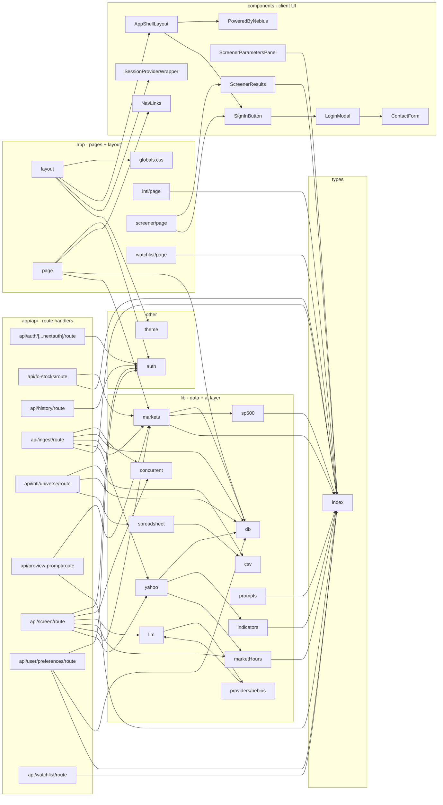

# Code Graph

> Auto-generated by [scripts/graph.mjs](../scripts/graph.mjs). Do not hand-edit.
> Re-run with `npm run graph` whenever the import structure changes.

**39 modules, 55 edges** across the `src/` tree.

## Module map

## Module index (who imports what)

| Module | Imported by | Imports |
|--------|-------------|---------|
| `app/api/auth/[...nextauth]/route` | — | auth |
| `app/api/fo-stocks/route` | — | lib/markets, types/index |
| `app/api/history/route` | — | auth |
| `app/api/ingest/route` | — | lib/concurrent, lib/db, lib/markets, lib/yahoo, types/index |
| `app/api/intl/universe/route` | — | lib/csv, lib/db, lib/spreadsheet |
| `app/api/preview-prompt/route` | — | lib/markets, types/index |
| `app/api/screen/route` | — | auth, lib/concurrent, lib/llm, lib/marketHours, lib/markets, lib/yahoo |
| `app/api/user/preferences/route` | — | auth, lib/db, types/index |
| `app/api/watchlist/route` | — | types/index |
| `app/globals.css` | app/layout | — |
| `app/intl/page` | — | types/index |
| `app/layout` | — | app/globals.css, components/AppShellLayout, components/SessionProviderWrapper, theme |
| `app/page` | — | auth, components/NavLinks, lib/db, lib/markets |
| `app/screener/page` | — | components/ScreenerResults, components/SignInButton |
| `app/watchlist/page` | — | types/index |
| `auth` | app/api/auth/[...nextauth]/route, app/api/history/route, app/api/screen/route, app/api/user/preferences/route, app/page | — |
| `components/AppShellLayout` | app/layout | components/PoweredByNebius, components/SignInButton |
| `components/ContactForm` | components/LoginModal | — |
| `components/LoginModal` | components/SignInButton | components/ContactForm |
| `components/NavLinks` | app/page | — |
| `components/PoweredByNebius` | components/AppShellLayout | — |
| `components/ScreenerParametersPanel` | — | types/index |
| `components/ScreenerResults` | app/screener/page | types/index |
| `components/SessionProviderWrapper` | app/layout | — |
| `components/SignInButton` | app/screener/page, components/AppShellLayout | components/LoginModal |
| `lib/concurrent` | app/api/ingest/route, app/api/screen/route | — |
| `lib/csv` | app/api/intl/universe/route, lib/spreadsheet | — |
| `lib/db` | app/api/ingest/route, app/api/intl/universe/route, app/api/user/preferences/route, app/page, lib/markets, lib/yahoo | — |
| `lib/indicators` | lib/yahoo | types/index |
| `lib/llm` | app/api/screen/route, lib/providers/nebius | lib/providers/nebius |
| `lib/marketHours` | app/api/screen/route, lib/yahoo | types/index |
| `lib/markets` | app/api/fo-stocks/route, app/api/ingest/route, app/api/preview-prompt/route, app/api/screen/route, app/page | lib/db, lib/sp500, types/index |
| `lib/prompts` | — | types/index |
| `lib/providers/nebius` | lib/llm | lib/llm |
| `lib/sp500` | lib/markets | types/index |
| `lib/spreadsheet` | app/api/intl/universe/route | lib/csv |
| `lib/yahoo` | app/api/ingest/route, app/api/screen/route | lib/db, lib/indicators, lib/marketHours |
| `theme` | app/layout | — |
| `types/index` | app/api/fo-stocks/route, app/api/ingest/route, app/api/preview-prompt/route, app/api/user/preferences/route, app/api/watchlist/route, app/intl/page, app/watchlist/page, components/ScreenerParametersPanel, components/ScreenerResults, lib/indicators, lib/marketHours, lib/markets, lib/prompts, lib/sp500 | — |
